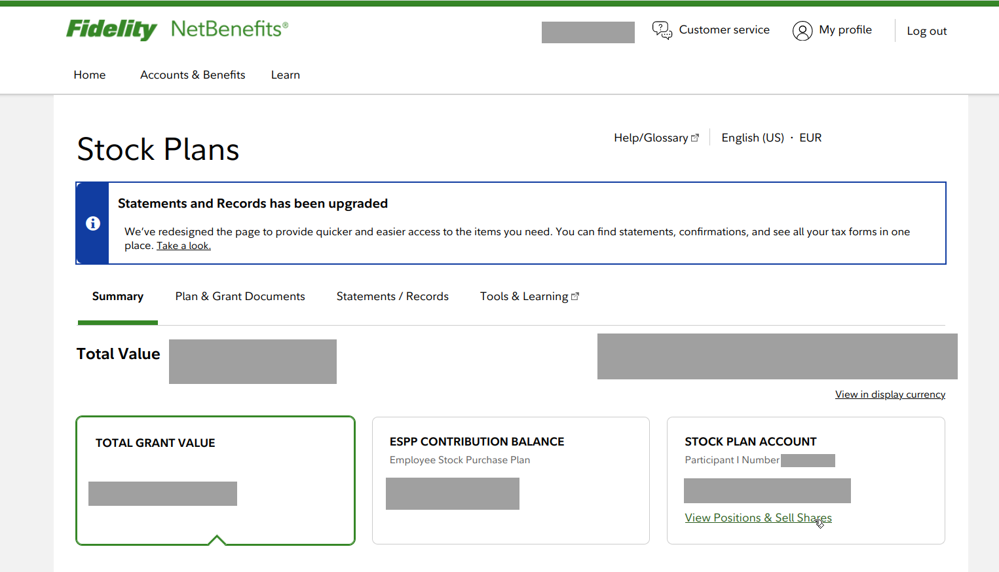
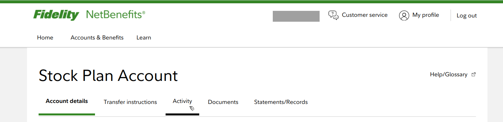
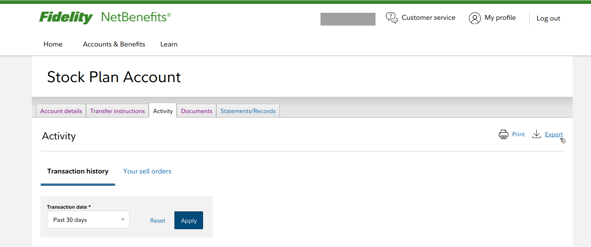

# Fidelity transactions export guide

## How to export transactions for tobcalc

1. Log in to Fidelity NetBenefits.
2. On the `Stock Plans` page, look for the `Stock Plan Account` box on the right, and click on the `View Positions & Shell Shares` link.

3. On the `Stock Plan Account` page, click on the `Activity` tab.

4. On the `Activity` page, make sure `Transaction history` is selected. Pick a range of transactions using the `Transaction date*` box. When you have chosen the transactions to export, click on the `Export` link on the right.

